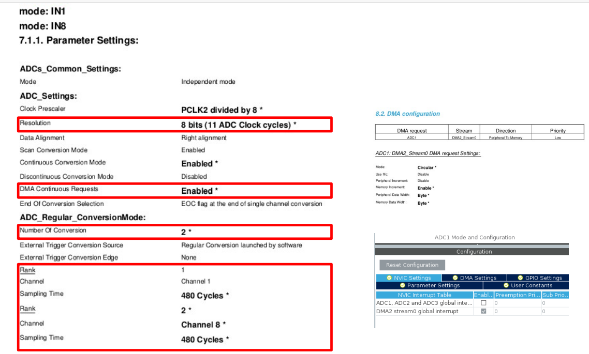

Dans STM21CubeMX:

file -> new Project

on cherches une carte qui s'appelle : `STM32F407G-DISC1`


On double click et ça devrait nous mettre un écran truc "initialize all peripherals" on mets oui


On renommes les leds pour que ça soit plus explicite,


pour les ADC :




pour finir :

main.c
```c
/* USER CODE BEGIN Header */
/**
  ******************************************************************************
  * @file           : main.c
  * @brief          : Main program body
  ******************************************************************************
  * @attention
  *
  * Copyright (c) 2022 STMicroelectronics.
  * All rights reserved.
  *
  * This software is licensed under terms that can be found in the LICENSE file
  * in the root directory of this software component.
  * If no LICENSE file comes with this software, it is provided AS-IS.
  *
  ******************************************************************************
  */
/* USER CODE END Header */
/* Includes ------------------------------------------------------------------*/
#include "main.h"
#include "usb_host.h"

/* Private includes ----------------------------------------------------------*/
/* USER CODE BEGIN Includes */

/* USER CODE END Includes */

/* Private typedef -----------------------------------------------------------*/
/* USER CODE BEGIN PTD */

/* USER CODE END PTD */

/* Private define ------------------------------------------------------------*/
/* USER CODE BEGIN PD */
/* USER CODE END PD */

/* Private macro -------------------------------------------------------------*/
/* USER CODE BEGIN PM */

/* USER CODE END PM */

/* Private variables ---------------------------------------------------------*/
ADC_HandleTypeDef hadc1;
DMA_HandleTypeDef hdma_adc1;

I2C_HandleTypeDef hi2c1;

I2S_HandleTypeDef hi2s3;

SPI_HandleTypeDef hspi1;

/* USER CODE BEGIN PV */

/* USER CODE END PV */

/* Private function prototypes -----------------------------------------------*/
void SystemClock_Config(void);
static void MX_GPIO_Init(void);
static void MX_DMA_Init(void);
static void MX_ADC1_Init(void);
static void MX_I2C1_Init(void);
static void MX_I2S3_Init(void);
static void MX_SPI1_Init(void);
void MX_USB_HOST_Process(void);

/* USER CODE BEGIN PFP */
uint8_t getJoystick();
uint8_t startGame();
/* USER CODE END PFP */

/* Private user code ---------------------------------------------------------*/
/* USER CODE BEGIN 0 */
GPIO_TypeDef* ports[4] = {LD3_Orange_GPIO_Port, LD5_Red_GPIO_Port, LD6_Blue_GPIO_Port, LD4_Green_GPIO_Port};
uint16_t pins[4] = {LD3_Orange_Pin, LD5_Red_Pin, LD6_Blue_Pin, LD4_Green_Pin};
/* USER CODE END 0 */

/**
  * @brief  The application entry point.
  * @retval int
  */
int main(void)
{
  /* USER CODE BEGIN 1 */
	uint8_t victoire = 1;
	int compteur = 0;
  /* USER CODE END 1 */

  /* MCU Configuration--------------------------------------------------------*/

  /* Reset of all peripherals, Initializes the Flash interface and the Systick. */
  HAL_Init();

  /* USER CODE BEGIN Init */

  /* USER CODE END Init */

  /* Configure the system clock */
  SystemClock_Config();

  /* USER CODE BEGIN SysInit */

  /* USER CODE END SysInit */

  /* Initialize all configured peripherals */
  MX_GPIO_Init();
  MX_DMA_Init();
  MX_ADC1_Init();
  MX_I2C1_Init();
  MX_I2S3_Init();
  MX_SPI1_Init();
  MX_USB_HOST_Init();
  /* USER CODE BEGIN 2 */

  /* USER CODE END 2 */

  /* Infinite loop */
  /* USER CODE BEGIN WHILE */
  while (1)
  {
	  // si on appuie sur le bouton bleu alors on lance une partie
	  if(HAL_GPIO_ReadPin(B1_GPIO_Port, B1_Pin) == GPIO_PIN_SET){
		  victoire = startGame();
	  }
	  // si l'utilisateur a perdu on affiche une boucle de leds et sinon une autre
	  if(victoire == 1){
		  compteur++;
		  if(compteur > 3){
			  compteur = 0;
		  }
		  HAL_GPIO_WritePin(ports[compteur], pins[compteur], GPIO_PIN_SET);
		  HAL_Delay(100);
		  HAL_GPIO_WritePin(ports[compteur], pins[compteur], GPIO_PIN_RESET);
	  } else {
		  HAL_GPIO_WritePin(ports[0],pins[0], GPIO_PIN_SET);
		  HAL_GPIO_WritePin(ports[1],pins[1], GPIO_PIN_SET);
		  HAL_GPIO_WritePin(ports[2],pins[2], GPIO_PIN_SET);
		  HAL_GPIO_WritePin(ports[3],pins[3], GPIO_PIN_SET);
		  HAL_Delay(200);
		  HAL_GPIO_WritePin(ports[0],pins[0], GPIO_PIN_RESET);
		  HAL_GPIO_WritePin(ports[1],pins[1], GPIO_PIN_RESET);
		  HAL_GPIO_WritePin(ports[2],pins[2], GPIO_PIN_RESET);
		  HAL_GPIO_WritePin(ports[3],pins[3], GPIO_PIN_RESET);
	  }

    /* USER CODE END WHILE */
    MX_USB_HOST_Process();

    /* USER CODE BEGIN 3 */
  }
  /* USER CODE END 3 */
}

/**
  * @brief System Clock Configuration
  * @retval None
  */
void SystemClock_Config(void)
{
  RCC_OscInitTypeDef RCC_OscInitStruct = {0};
  RCC_ClkInitTypeDef RCC_ClkInitStruct = {0};

  /** Configure the main internal regulator output voltage
  */
  __HAL_RCC_PWR_CLK_ENABLE();
  __HAL_PWR_VOLTAGESCALING_CONFIG(PWR_REGULATOR_VOLTAGE_SCALE1);
  /** Initializes the RCC Oscillators according to the specified parameters
  * in the RCC_OscInitTypeDef structure.
  */
  RCC_OscInitStruct.OscillatorType = RCC_OSCILLATORTYPE_HSE;
  RCC_OscInitStruct.HSEState = RCC_HSE_ON;
  RCC_OscInitStruct.PLL.PLLState = RCC_PLL_ON;
  RCC_OscInitStruct.PLL.PLLSource = RCC_PLLSOURCE_HSE;
  RCC_OscInitStruct.PLL.PLLM = 8;
  RCC_OscInitStruct.PLL.PLLN = 336;
  RCC_OscInitStruct.PLL.PLLP = RCC_PLLP_DIV2;
  RCC_OscInitStruct.PLL.PLLQ = 7;
  if (HAL_RCC_OscConfig(&RCC_OscInitStruct) != HAL_OK)
  {
    Error_Handler();
  }
  /** Initializes the CPU, AHB and APB buses clocks
  */
  RCC_ClkInitStruct.ClockType = RCC_CLOCKTYPE_HCLK|RCC_CLOCKTYPE_SYSCLK
                              |RCC_CLOCKTYPE_PCLK1|RCC_CLOCKTYPE_PCLK2;
  RCC_ClkInitStruct.SYSCLKSource = RCC_SYSCLKSOURCE_PLLCLK;
  RCC_ClkInitStruct.AHBCLKDivider = RCC_SYSCLK_DIV1;
  RCC_ClkInitStruct.APB1CLKDivider = RCC_HCLK_DIV4;
  RCC_ClkInitStruct.APB2CLKDivider = RCC_HCLK_DIV2;

  if (HAL_RCC_ClockConfig(&RCC_ClkInitStruct, FLASH_LATENCY_5) != HAL_OK)
  {
    Error_Handler();
  }
}

/**
  * @brief ADC1 Initialization Function
  * @param None
  * @retval None
  */
static void MX_ADC1_Init(void)
{

  /* USER CODE BEGIN ADC1_Init 0 */

  /* USER CODE END ADC1_Init 0 */

  ADC_ChannelConfTypeDef sConfig = {0};

  /* USER CODE BEGIN ADC1_Init 1 */

  /* USER CODE END ADC1_Init 1 */
  /** Configure the global features of the ADC (Clock, Resolution, Data Alignment and number of conversion)
  */
  hadc1.Instance = ADC1;
  hadc1.Init.ClockPrescaler = ADC_CLOCK_SYNC_PCLK_DIV8;
  hadc1.Init.Resolution = ADC_RESOLUTION_8B;
  hadc1.Init.ScanConvMode = ENABLE;
  hadc1.Init.ContinuousConvMode = ENABLE;
  hadc1.Init.DiscontinuousConvMode = DISABLE;
  hadc1.Init.ExternalTrigConvEdge = ADC_EXTERNALTRIGCONVEDGE_NONE;
  hadc1.Init.ExternalTrigConv = ADC_SOFTWARE_START;
  hadc1.Init.DataAlign = ADC_DATAALIGN_RIGHT;
  hadc1.Init.NbrOfConversion = 2;
  hadc1.Init.DMAContinuousRequests = DISABLE;
  hadc1.Init.EOCSelection = ADC_EOC_SINGLE_CONV;
  if (HAL_ADC_Init(&hadc1) != HAL_OK)
  {
    Error_Handler();
  }
  /** Configure for the selected ADC regular channel its corresponding rank in the sequencer and its sample time.
  */
  sConfig.Channel = ADC_CHANNEL_1;
  sConfig.Rank = 1;
  sConfig.SamplingTime = ADC_SAMPLETIME_480CYCLES;
  if (HAL_ADC_ConfigChannel(&hadc1, &sConfig) != HAL_OK)
  {
    Error_Handler();
  }
  /** Configure for the selected ADC regular channel its corresponding rank in the sequencer and its sample time.
  */
  sConfig.Channel = ADC_CHANNEL_8;
  sConfig.Rank = 2;
  if (HAL_ADC_ConfigChannel(&hadc1, &sConfig) != HAL_OK)
  {
    Error_Handler();
  }
  /* USER CODE BEGIN ADC1_Init 2 */

  /* USER CODE END ADC1_Init 2 */

}

/**
  * @brief I2C1 Initialization Function
  * @param None
  * @retval None
  */
static void MX_I2C1_Init(void)
{

  /* USER CODE BEGIN I2C1_Init 0 */

  /* USER CODE END I2C1_Init 0 */

  /* USER CODE BEGIN I2C1_Init 1 */

  /* USER CODE END I2C1_Init 1 */
  hi2c1.Instance = I2C1;
  hi2c1.Init.ClockSpeed = 100000;
  hi2c1.Init.DutyCycle = I2C_DUTYCYCLE_2;
  hi2c1.Init.OwnAddress1 = 0;
  hi2c1.Init.AddressingMode = I2C_ADDRESSINGMODE_7BIT;
  hi2c1.Init.DualAddressMode = I2C_DUALADDRESS_DISABLE;
  hi2c1.Init.OwnAddress2 = 0;
  hi2c1.Init.GeneralCallMode = I2C_GENERALCALL_DISABLE;
  hi2c1.Init.NoStretchMode = I2C_NOSTRETCH_DISABLE;
  if (HAL_I2C_Init(&hi2c1) != HAL_OK)
  {
    Error_Handler();
  }
  /* USER CODE BEGIN I2C1_Init 2 */

  /* USER CODE END I2C1_Init 2 */

}

/**
  * @brief I2S3 Initialization Function
  * @param None
  * @retval None
  */
static void MX_I2S3_Init(void)
{

  /* USER CODE BEGIN I2S3_Init 0 */

  /* USER CODE END I2S3_Init 0 */

  /* USER CODE BEGIN I2S3_Init 1 */

  /* USER CODE END I2S3_Init 1 */
  hi2s3.Instance = SPI3;
  hi2s3.Init.Mode = I2S_MODE_MASTER_TX;
  hi2s3.Init.Standard = I2S_STANDARD_PHILIPS;
  hi2s3.Init.DataFormat = I2S_DATAFORMAT_16B;
  hi2s3.Init.MCLKOutput = I2S_MCLKOUTPUT_ENABLE;
  hi2s3.Init.AudioFreq = I2S_AUDIOFREQ_96K;
  hi2s3.Init.CPOL = I2S_CPOL_LOW;
  hi2s3.Init.ClockSource = I2S_CLOCK_PLL;
  hi2s3.Init.FullDuplexMode = I2S_FULLDUPLEXMODE_DISABLE;
  if (HAL_I2S_Init(&hi2s3) != HAL_OK)
  {
    Error_Handler();
  }
  /* USER CODE BEGIN I2S3_Init 2 */

  /* USER CODE END I2S3_Init 2 */

}

/**
  * @brief SPI1 Initialization Function
  * @param None
  * @retval None
  */
static void MX_SPI1_Init(void)
{

  /* USER CODE BEGIN SPI1_Init 0 */

  /* USER CODE END SPI1_Init 0 */

  /* USER CODE BEGIN SPI1_Init 1 */

  /* USER CODE END SPI1_Init 1 */
  /* SPI1 parameter configuration*/
  hspi1.Instance = SPI1;
  hspi1.Init.Mode = SPI_MODE_MASTER;
  hspi1.Init.Direction = SPI_DIRECTION_2LINES;
  hspi1.Init.DataSize = SPI_DATASIZE_8BIT;
  hspi1.Init.CLKPolarity = SPI_POLARITY_LOW;
  hspi1.Init.CLKPhase = SPI_PHASE_1EDGE;
  hspi1.Init.NSS = SPI_NSS_SOFT;
  hspi1.Init.BaudRatePrescaler = SPI_BAUDRATEPRESCALER_2;
  hspi1.Init.FirstBit = SPI_FIRSTBIT_MSB;
  hspi1.Init.TIMode = SPI_TIMODE_DISABLE;
  hspi1.Init.CRCCalculation = SPI_CRCCALCULATION_DISABLE;
  hspi1.Init.CRCPolynomial = 10;
  if (HAL_SPI_Init(&hspi1) != HAL_OK)
  {
    Error_Handler();
  }
  /* USER CODE BEGIN SPI1_Init 2 */

  /* USER CODE END SPI1_Init 2 */

}

/**
  * Enable DMA controller clock
  */
static void MX_DMA_Init(void)
{

  /* DMA controller clock enable */
  __HAL_RCC_DMA2_CLK_ENABLE();

  /* DMA interrupt init */
  /* DMA2_Stream0_IRQn interrupt configuration */
  HAL_NVIC_SetPriority(DMA2_Stream0_IRQn, 0, 0);
  HAL_NVIC_EnableIRQ(DMA2_Stream0_IRQn);

}

/**
  * @brief GPIO Initialization Function
  * @param None
  * @retval None
  */
static void MX_GPIO_Init(void)
{
  GPIO_InitTypeDef GPIO_InitStruct = {0};

  /* GPIO Ports Clock Enable */
  __HAL_RCC_GPIOE_CLK_ENABLE();
  __HAL_RCC_GPIOC_CLK_ENABLE();
  __HAL_RCC_GPIOH_CLK_ENABLE();
  __HAL_RCC_GPIOA_CLK_ENABLE();
  __HAL_RCC_GPIOB_CLK_ENABLE();
  __HAL_RCC_GPIOD_CLK_ENABLE();

  /*Configure GPIO pin Output Level */
  HAL_GPIO_WritePin(CS_I2C_SPI_GPIO_Port, CS_I2C_SPI_Pin, GPIO_PIN_RESET);

  /*Configure GPIO pin Output Level */
  HAL_GPIO_WritePin(OTG_FS_PowerSwitchOn_GPIO_Port, OTG_FS_PowerSwitchOn_Pin, GPIO_PIN_SET);

  /*Configure GPIO pin Output Level */
  HAL_GPIO_WritePin(GPIOD, LD4_Green_Pin|LD3_Orange_Pin|LD5_Red_Pin|LD6_Blue_Pin
                          |Audio_RST_Pin, GPIO_PIN_RESET);

  /*Configure GPIO pin : CS_I2C_SPI_Pin */
  GPIO_InitStruct.Pin = CS_I2C_SPI_Pin;
  GPIO_InitStruct.Mode = GPIO_MODE_OUTPUT_PP;
  GPIO_InitStruct.Pull = GPIO_NOPULL;
  GPIO_InitStruct.Speed = GPIO_SPEED_FREQ_LOW;
  HAL_GPIO_Init(CS_I2C_SPI_GPIO_Port, &GPIO_InitStruct);

  /*Configure GPIO pin : OTG_FS_PowerSwitchOn_Pin */
  GPIO_InitStruct.Pin = OTG_FS_PowerSwitchOn_Pin;
  GPIO_InitStruct.Mode = GPIO_MODE_OUTPUT_PP;
  GPIO_InitStruct.Pull = GPIO_NOPULL;
  GPIO_InitStruct.Speed = GPIO_SPEED_FREQ_LOW;
  HAL_GPIO_Init(OTG_FS_PowerSwitchOn_GPIO_Port, &GPIO_InitStruct);

  /*Configure GPIO pin : PDM_OUT_Pin */
  GPIO_InitStruct.Pin = PDM_OUT_Pin;
  GPIO_InitStruct.Mode = GPIO_MODE_AF_PP;
  GPIO_InitStruct.Pull = GPIO_NOPULL;
  GPIO_InitStruct.Speed = GPIO_SPEED_FREQ_LOW;
  GPIO_InitStruct.Alternate = GPIO_AF5_SPI2;
  HAL_GPIO_Init(PDM_OUT_GPIO_Port, &GPIO_InitStruct);

  /*Configure GPIO pin : B1_Pin */
  GPIO_InitStruct.Pin = B1_Pin;
  GPIO_InitStruct.Mode = GPIO_MODE_EVT_RISING;
  GPIO_InitStruct.Pull = GPIO_NOPULL;
  HAL_GPIO_Init(B1_GPIO_Port, &GPIO_InitStruct);

  /*Configure GPIO pin : BOOT1_Pin */
  GPIO_InitStruct.Pin = BOOT1_Pin;
  GPIO_InitStruct.Mode = GPIO_MODE_INPUT;
  GPIO_InitStruct.Pull = GPIO_NOPULL;
  HAL_GPIO_Init(BOOT1_GPIO_Port, &GPIO_InitStruct);

  /*Configure GPIO pin : CLK_IN_Pin */
  GPIO_InitStruct.Pin = CLK_IN_Pin;
  GPIO_InitStruct.Mode = GPIO_MODE_AF_PP;
  GPIO_InitStruct.Pull = GPIO_NOPULL;
  GPIO_InitStruct.Speed = GPIO_SPEED_FREQ_LOW;
  GPIO_InitStruct.Alternate = GPIO_AF5_SPI2;
  HAL_GPIO_Init(CLK_IN_GPIO_Port, &GPIO_InitStruct);

  /*Configure GPIO pins : LD4_Green_Pin LD3_Orange_Pin LD5_Red_Pin LD6_Blue_Pin
                           Audio_RST_Pin */
  GPIO_InitStruct.Pin = LD4_Green_Pin|LD3_Orange_Pin|LD5_Red_Pin|LD6_Blue_Pin
                          |Audio_RST_Pin;
  GPIO_InitStruct.Mode = GPIO_MODE_OUTPUT_PP;
  GPIO_InitStruct.Pull = GPIO_NOPULL;
  GPIO_InitStruct.Speed = GPIO_SPEED_FREQ_LOW;
  HAL_GPIO_Init(GPIOD, &GPIO_InitStruct);

  /*Configure GPIO pin : OTG_FS_OverCurrent_Pin */
  GPIO_InitStruct.Pin = OTG_FS_OverCurrent_Pin;
  GPIO_InitStruct.Mode = GPIO_MODE_INPUT;
  GPIO_InitStruct.Pull = GPIO_NOPULL;
  HAL_GPIO_Init(OTG_FS_OverCurrent_GPIO_Port, &GPIO_InitStruct);

  /*Configure GPIO pin : MEMS_INT2_Pin */
  GPIO_InitStruct.Pin = MEMS_INT2_Pin;
  GPIO_InitStruct.Mode = GPIO_MODE_EVT_RISING;
  GPIO_InitStruct.Pull = GPIO_NOPULL;
  HAL_GPIO_Init(MEMS_INT2_GPIO_Port, &GPIO_InitStruct);

}

/* USER CODE BEGIN 4 */
uint8_t startGame(){
	// on va d'abord générer la suite à atteindre et l'afficher
	GPIO_TypeDef* gamePorts[30] = {};
	uint16_t gamePins[30] = {};
	for(int i = 0;i<30;i++){
		uint8_t randNb = rand() % 4;
		gamePorts[i] = ports[randNb];
		gamePins[i] = pins[randNb];
		HAL_GPIO_WritePin(gamePorts[i],gamePins[i],GPIO_PIN_SET);
		HAL_Delay(500);
		HAL_GPIO_WritePin(gamePorts[i],gamePins[i],GPIO_PIN_RESET);
		HAL_Delay(100);
	}
	// la boucle de jeu, on attend que l'utilisateur entre les lumières dans l'ordre et on lui affiche sa combinaison, si ce n'est pas le bon ordre alors on renvoie un 1
	for(int i = 0;i<30;i++){
		uint8_t dir = getJoystick();
		while(dir==4){
			dir = getJoystick();
			// si l'utilisateur n'entre rien on reprend sa prochaine entrée
		}
		// on vérifie que ça soit la bonne combinaison
		if(gamePins[i] != pins[dir]){
			return 1;
		}
		for(int j = 0;j<=i;j++){
			HAL_GPIO_WritePin(gamePorts[j],gamePins[j],GPIO_PIN_SET);
			HAL_Delay(500);
			HAL_GPIO_WritePin(gamePorts[j],gamePins[j],GPIO_PIN_RESET);
			HAL_Delay(100);
			// on allume la led 0,5 secondes puis on attend 0,1 secondes avant d'envoyer la suivante
		}

	}
	// l'utilisateur a gagné, en renvoie un 0
	return 0;
}

uint8_t getJoystick(){
	uint8_t adcBuffer[2];
	HAL_ADC_Start_DMA(&hadc1, (uint32_t *)adcBuffer, 2);
	uint8_t x = adcBuffer[0];
	uint8_t y = adcBuffer[1];
	uint8_t xAbs = abs(x-126);
	uint8_t yAbs = abs(y-126);
	if(yAbs>30 || xAbs>30){
		if(xAbs > yAbs){
			if(x>126){
				// droite donc LED Rouge
				return 1;
			} else {
				// gauche donc LED Verte
				return 3;
			}
		} else {
			if(y>126){
				// bas donc LED Bleue
				return 2;
			} else {
				// haut donc LED Orange
				return 0;
			}
		}
	}
	return 4;
}
/* USER CODE END 4 */

/**
  * @brief  This function is executed in case of error occurrence.
  * @retval None
  */
void Error_Handler(void)
{
  /* USER CODE BEGIN Error_Handler_Debug */
  /* User can add his own implementation to report the HAL error return state */
  __disable_irq();
  while (1)
  {
  }
  /* USER CODE END Error_Handler_Debug */
}

#ifdef  USE_FULL_ASSERT
/**
  * @brief  Reports the name of the source file and the source line number
  *         where the assert_param error has occurred.
  * @param  file: pointer to the source file name
  * @param  line: assert_param error line source number
  * @retval None
  */
void assert_failed(uint8_t *file, uint32_t line)
{
  /* USER CODE BEGIN 6 */
  /* User can add his own implementation to report the file name and line number,
     ex: printf("Wrong parameters value: file %s on line %d\r\n", file, line) */
  /* USER CODE END 6 */
}
#endif /* USE_FULL_ASSERT */


```

J'ai essayé de commenter au mieux le code


On appuies sur le bouton bleu ça lance une partie, c'est un simon donc une série de leds nous est affichée et on dois les mémoriser, une fois que les 30 leds sont passées c'est à nous de les remettre dans l'ordre, si nous nous trompons les leds vont s'allumer dans le sens des aiguilles d'une montre et il faudra que nous reappuions sur le bouton bleu pour lancer une autre partie, si nous arrivons à faire les 30 leds les leds vont se mettre à clignoter.

pour le joystick il faut brancher les ports PA1 et PB0